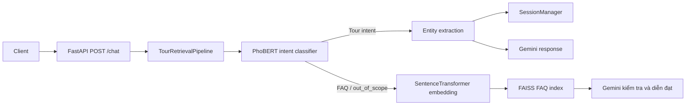

# Chatbot AI Tư Vấn Du Lịch

Đây là dự án chatbot tư vấn du lịch bằng tiếng Việt. Hệ thống kết hợp phân loại ý định bằng PhoBERT, trích xuất thực thể du lịch, truy xuất FAQ bằng FAISS và tạo phản hồi tự nhiên bằng Gemini.

## Mục Tiêu

Chatbot được thiết kế để:

- Trả lời các câu hỏi FAQ về du lịch theo địa điểm, thời tiết, văn hóa, vận chuyển, ăn uống, dịch vụ, mua sắm và giải trí.
- Thu thập thông tin cần thiết để tìm tour gồm điểm đến, thời gian khởi hành và ngân sách.
- Duy trì ngữ cảnh hội thoại ngắn hạn qua session để người dùng có thể bổ sung thông tin qua nhiều lượt chat.
- Cung cấp API HTTP đơn giản để tích hợp vào giao diện web, mobile hoặc hệ thống CRM.

## Kiến Trúc Tổng Quan



Luồng chính nằm trong `server.py` và `pipelines/tour_pipeline.py`.

## Thành Phần Chính

- `server.py`: khởi tạo FastAPI và endpoint `/chat`.
- `pipelines/tour_pipeline.py`: điều phối phân loại intent, trích xuất entity, quản lý session và tạo phản hồi.
- `pipelines/retrieval.py`: truy xuất câu trả lời FAQ gần nhất từ FAISS index.
- `pipelines/create_faiss_index.py`: tạo `faq_index.faiss` và `faq_metadata.json` từ dữ liệu FAQ đã xử lý.
- `google_genAI.py`: wrapper gọi Gemini để sinh hoặc kiểm tra câu trả lời.
- `extractors/`: trích xuất địa điểm, thời gian và giá từ truy vấn tiếng Việt.
- `training/phobert_intent_finetuned_train.py`: script fine-tune PhoBERT cho bài toán phân loại intent.
- `scripts/`: các script sinh, gộp và xử lý dữ liệu FAQ hoặc intent.
- `data/raw/`: dữ liệu thô.
- `data/processed/`: dữ liệu đã xử lý dùng cho index và huấn luyện.

## Dữ Liệu Và Artifact

Dự án hiện có các artifact và dataset chính:

- `data/processed/faq_cleaned.json`: khoảng 3.504 cặp FAQ đã xử lý.
- `faq_metadata.json`: metadata đồng bộ với FAISS index.
- `faq_index.faiss`: vector index dùng cho FAQ retrieval.
- `data/processed/intent_merged.json`: khoảng 11.904 mẫu huấn luyện intent.
- `training/VnCoreNLP-1.1.1.jar`: dependency Java dùng để tách từ và nhận diện thực thể.
- `training/phobert_intent_finetuned/`: thư mục model intent sau khi huấn luyện. Thư mục này đang nằm trong `.gitignore`, nên cần tự tạo hoặc cung cấp khi triển khai.

Các intent đang được pipeline sử dụng:

- `find_tour_with_location`
- `find_tour_with_time`
- `find_tour_with_price`
- `find_tour_with_location_and_time`
- `find_tour_with_location_and_price`
- `find_tour_with_time_and_price`
- `find_with_all`
- `out_of_scope`

## Yêu Cầu Môi Trường

- Python 3.10 hoặc 3.11.
- Java Runtime để chạy VnCoreNLP.
- Gemini API key.
- Máy có đủ RAM để load PhoBERT, SentenceTransformer và VnCoreNLP cùng lúc.

Lưu ý: `requirements.txt` hiện chưa phản ánh đầy đủ dependency runtime của dự án. Ngoài các package đang có trong file này, code còn dùng FastAPI, Uvicorn, Torch, Transformers, SentenceTransformers, FAISS, NumPy, VnCoreNLP, Google GenAI SDK, Datasets, python-dotenv, python-dateutil và một số package phục vụ script sinh dữ liệu.

## Cài Đặt

Tạo môi trường ảo:

```bash
python -m venv .venv
source .venv/bin/activate
```

Cài dependency hiện có:

```bash
pip install -r requirements.txt
```

Nếu chưa cập nhật `requirements.txt`, cần cài thêm các dependency runtime tối thiểu:

```bash
pip install fastapi uvicorn pydantic numpy torch transformers sentence-transformers faiss-cpu vncorenlp python-dateutil google-genai google-generativeai python-dotenv datasets accelerate ratelimit
```

Tạo file `.env` từ mẫu và đặt API key của bạn:

```bash
cp .env.example .env
```

Trong `.env`, dùng dạng:

```env
GOOGLE_API_KEY=your_google_api_key_here
```

Không commit API key thật lên repository.

## Chuẩn Bị Model Và Index

Fine-tune model intent nếu chưa có thư mục `training/phobert_intent_finetuned/`:

```bash
python training/phobert_intent_finetuned_train.py
```

Tạo lại FAISS index sau khi thay đổi FAQ:

```bash
python pipelines/create_faiss_index.py
```

Sau khi chạy, dự án cần có:

- `faq_index.faiss`
- `faq_metadata.json`
- `training/phobert_intent_finetuned/`

## Chạy API

Chạy server:

```bash
python server.py
```

Hoặc:

```bash
uvicorn server:app --host 0.0.0.0 --port 8000 --reload
```

Gọi thử API:

```bash
curl -X POST http://localhost:8000/chat \
  -H "Content-Type: application/json" \
  -d '{"query":"Tôi muốn đi Đà Lạt tháng 12 khoảng 5 triệu","user_id":"demo_user"}'
```

Response mẫu:

```json
{
  "status": "success",
  "response": "Dạ, em đã tìm được một số tour phù hợp như:",
  "location": "Đà Lạt",
  "time": "2026-12",
  "price": "5000000"
}
```

Các giá trị `status` chính:

- `missing_info`: người dùng chưa cung cấp đủ điểm đến, thời gian hoặc giá.
- `success`: pipeline đã thu thập đủ thông tin tour.
- `faq`: pipeline chuyển sang trả lời FAQ hoặc phản hồi ngoài phạm vi.

## Quy Trình Dữ Liệu

Gộp dữ liệu intent:

```bash
python scripts/mergeData.py
```

Huấn luyện intent:

```bash
python training/phobert_intent_finetuned_train.py
```

Tạo index FAQ:

```bash
python pipelines/create_faiss_index.py
```

Một số script trong `scripts/` có dùng Gemini để sinh dữ liệu. Trước khi chạy các script này, cần đảm bảo `GOOGLE_API_KEY` đã được cấu hình qua biến môi trường.

## Lưu Ý Hiện Trạng

- `server.py` có nhận `user_id`, nhưng hiện chưa truyền `request.user_id` vào pipeline.
- `google_genAI.py` đang khởi tạo Gemini client trực tiếp trong hàm gọi, nên nên chuyển sang dùng biến môi trường và tái sử dụng client.
- Pipeline tour hiện mới xác nhận đủ thông tin tìm tour, chưa có bước truy vấn kho tour thật để liệt kê tour cụ thể.
- FAQ retrieval đang dùng ngưỡng khoảng cách cố định và chưa trả về nguồn hoặc điểm tin cậy.
- Cần bổ sung test tự động cho intent, entity extraction, retrieval và API contract.

Chi tiết đánh giá và hướng phát triển nằm trong `CHATBOT_REVIEW_AND_ROADMAP.md`.
