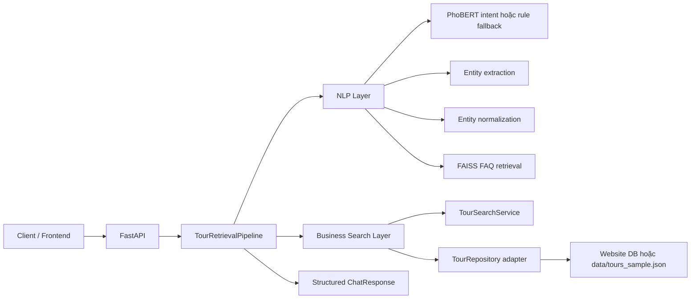

# Vietnamese Travel Chatbot Backend

Backend chatbot tư vấn du lịch tiếng Việt. Dự án giữ ý tưởng NLP pipeline hiện có gồm intent classification, entity extraction, FAQ retrieval bằng FAISS và Gemini để diễn đạt tự nhiên, đồng thời bổ sung business search layer để tìm tour thật từ data source có cấu trúc.

## Kiến Trúc Sau Refactor



Các lớp chính:

- `server.py`: FastAPI app, endpoint `/chat` và `/health`.
- `pipelines/tour_pipeline.py`: orchestration layer, giữ context/session, gọi NLP và business search.
- `extractors/`: trích xuất location, time, price từ câu tiếng Việt.
- `services/entity_normalizer.py`: chuẩn hóa entity raw thành filter nghiệp vụ như `destination_normalized`, `date_start`, `date_end`, `price_min`, `price_max`.
- `services/tour_search_service.py`: lọc và rank tour bằng logic deterministic.
- `repositories/tour_repository.py`: adapter đọc tour. Hiện có `JsonTourRepository`, có thể thay bằng repository kết nối database website.
- `schemas/`: response và model dữ liệu dùng giữa backend và frontend.
- `pipelines/retrieval.py`: FAQ retrieval bằng FAISS, trả thêm metadata score/source/question.

## Tour Search Và FAQ Khác Nhau Như Thế Nào

Tour search là business flow. Khi người dùng đã cung cấp đủ điểm đến, thời gian và ngân sách, backend tạo structured filters rồi tìm trong nguồn tour thật bằng `TourSearchService`. LLM không quyết định tour nào hợp lệ.

FAQ retrieval là knowledge flow. Khi intent là `out_of_scope` hoặc câu hỏi phù hợp FAQ, backend dùng FAISS để lấy câu trả lời từ `faq_metadata.json`. Gemini chỉ được dùng để diễn đạt lại ngắn gọn, không phải nguồn sự thật.

## Response API

`POST /chat` trả response có cấu trúc ổn định:

```json
{
  "status": "success",
  "message": "Dạ, em tìm được 2 tour phù hợp:",
  "entities": {
    "location": "Đà Lạt",
    "time": "2026-12",
    "price": "5000000",
    "destination_normalized": "da-lat",
    "date_start": "2026-12-01",
    "date_end": "2026-12-31",
    "price_min": null,
    "price_max": 5000000
  },
  "missing_fields": [],
  "tours": [
    {
      "id": "tour_dalat_001",
      "name": "Đà Lạt 3N2Đ săn mây và khám phá Langbiang",
      "destination": "Đà Lạt",
      "destination_normalized": "da-lat",
      "departure_date": "2026-12-12",
      "price": 4590000,
      "url": "/tour/tour_dalat_001",
      "duration_days": 3,
      "rating": 4.7,
      "popularity": 92
    }
  ],
  "faq_sources": []
}
```

Các `status` chính:

- `missing_info`: thiếu `location`, `time` hoặc `price`.
- `success`: đủ thông tin và tìm thấy tour.
- `no_results`: đủ thông tin nhưng chưa có tour phù hợp.
- `faq`: trả lời theo FAQ/fallback.

## Yêu Cầu Môi Trường

- Python 3.10 hoặc 3.11.
- Java Runtime nếu dùng VnCoreNLP.
- `GOOGLE_API_KEY` nếu muốn Gemini diễn đạt câu trả lời tự nhiên.
- Artifact model intent PhoBERT nếu muốn dùng classifier thật thay vì rule fallback.

## Biến Môi Trường

Tạo `.env` từ `.env.example`:

```bash
cp .env.example .env
```

Các biến chính:

```env
GOOGLE_API_KEY=your_google_api_key_here
GEMINI_MODEL=gemini-2.0-flash
TOUR_DATA_FILE=data/tours_sample.json
```

Không commit `.env`. File `.env.example` chỉ được chứa placeholder.

## Cài Đặt Từ Fresh Clone

```bash
python -m venv .venv
source .venv/bin/activate
pip install -r requirements.txt
```

Nếu chạy trên máy Apple Silicon hoặc môi trường đặc biệt, `faiss-cpu`, `torch` hoặc `vncorenlp` có thể cần cài theo hướng dẫn riêng của từng package.

## Chạy API

```bash
uvicorn server:app --host 0.0.0.0 --port 8000 --reload
```

Health check:

```bash
curl http://localhost:8000/health
```

Chat:

```bash
curl -X POST http://localhost:8000/chat \
  -H "Content-Type: application/json" \
  -d '{"query":"Tôi muốn đi Đà Lạt tháng 12 năm 2026 khoảng 5 triệu","user_id":"demo_user"}'
```

## Nguồn Dữ Liệu Tour

Repo hiện không có cơ chế database/web-app data access thật. Vì vậy refactor hiện dùng adapter:

- `repositories/tour_repository.py`
- `data/tours_sample.json`
- biến môi trường `TOUR_DATA_FILE`

Khi có database thật của website, tạo repository mới implement method `list_tours()` và trả về danh sách `Tour`. `TourSearchService` và `TourRetrievalPipeline` không cần đổi nếu repository mới giữ cùng contract.

Schema tour tối thiểu:

```json
{
  "id": "tour_dalat_001",
  "name": "Đà Lạt 3N2Đ",
  "destination": "Đà Lạt",
  "destination_normalized": "da-lat",
  "departure_date": "2026-12-12",
  "price": 4590000,
  "url": "/tour/tour_dalat_001"
}
```

## Artifact Cần Có

Artifact có thể tái tạo:

- `faq_index.faiss`: tạo lại bằng `python pipelines/create_faiss_index.py`.
- `faq_metadata.json`: tạo cùng FAISS index.
- `training/phobert_intent_finetuned/`: tạo bằng script training hoặc lấy từ model registry.

Nếu chưa có `training/phobert_intent_finetuned/`, pipeline sẽ fallback sang rule-based intent để API vẫn chạy được, nhưng chất lượng intent sẽ thấp hơn.

## Huấn Luyện Và Tạo Index

Tạo lại FAISS FAQ index:

```bash
python pipelines/create_faiss_index.py
```

Huấn luyện PhoBERT intent:

```bash
python training/phobert_intent_finetuned_train.py
```

Dữ liệu chính:

- `data/processed/faq_cleaned.json`: FAQ đã xử lý.
- `faq_metadata.json`: metadata cho FAQ retrieval.
- `data/processed/intent_merged.json`: dữ liệu train intent.
- `data/tours_sample.json`: tour mẫu cho repository adapter hiện tại.

## Test

```bash
python -m pytest -q
```

Test hiện bao phủ:

- API smoke test cho `/health` và `/chat`.
- Parser thời gian.
- Parser giá.
- Tour search deterministic.
- Session tách theo `user_id`.

## Ghi Chú Triển Khai

- Gemini chỉ dùng để diễn đạt message/fallback, không dùng để chọn tour.
- Business filtering nằm trong `TourSearchService`.
- Session hiện vẫn in-memory, phù hợp local/demo. Production nên thay bằng Redis hoặc database.
- FAQ retrieval dùng embedding hiện tại `all-MiniLM-L6-v2`; nên đánh giá lại với embedding tiếng Việt hoặc multilingual tốt hơn khi có evaluation set.
